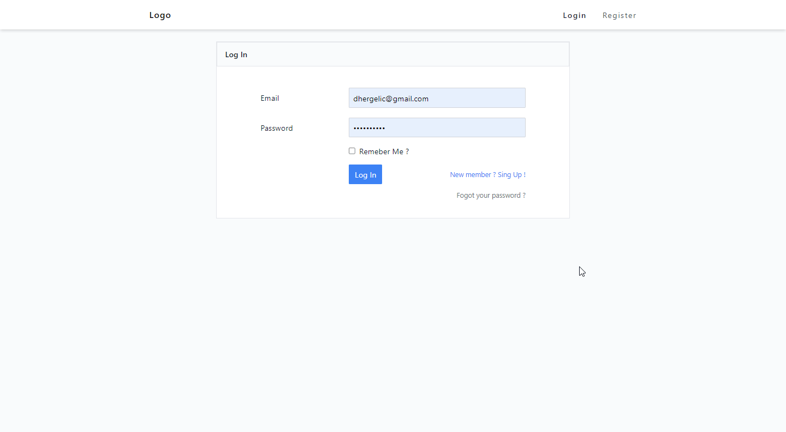
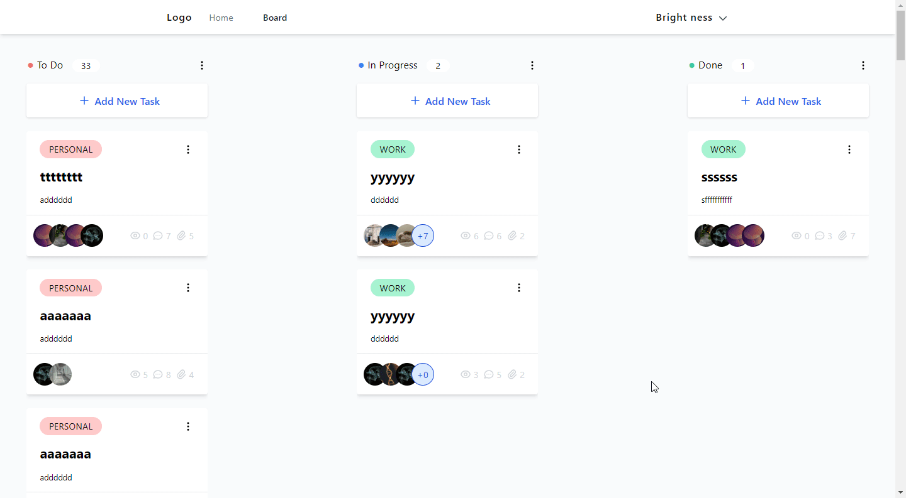
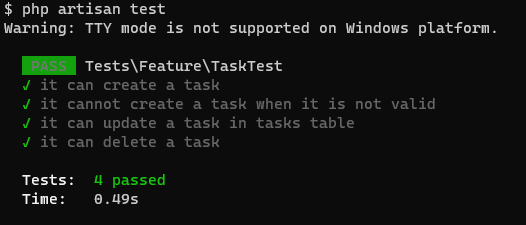
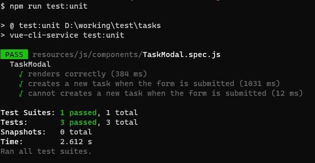

# Laravel Vue Tasks

Laravel and Vue Tasks like Trello using tailwindCSS for styling and sanctum for authentification





## Features

-   Laravel 8
-   Vue + VueRouter + Vuex
-   MySQL
-   Login, register, update profile
-   password reset
-   Tasks Board View(Drag and Drop) and Table View
-   Authentication with Sanctum
-   Tailwind, Vue3-smooth-dnd

## Installation

```
git clone https://github.com/Brightness999/laravel-vue-tasks tasks

cd tasks

composer install

cp .env.example .env
```

Current .env.example contains my db connection details, so set your database connection details in `.env` directly

```
php artisan key:generate

php artisan migrate

npm install
```

#### Run the Backend

```
php artisan serve
```
#### Run the Vue Frontend in Development & Watch mode
```
npm run dev
npm run watch
```
#### Run the Vue Frontend in Production Mode

```
npm run prod
```


### Unit Testing

#### PHP


#### Vue


